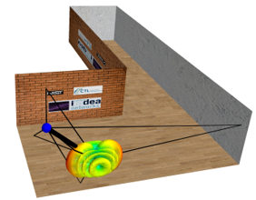

# Q-D visualizer
This repository contains a python application for visualizing scenarios simulated in ns-3. 

## Features:
1. This application allows to visualizer the beamforming training evolution, and in particular, the SLS TxSS and RxSS phase. Each beamforming training is visualized thanks to the directivitry of the antenna pattern resulting of the beamforming training phase. For each beamforming training; the SNR table can be visualized. 
1. The Multi-Paths components between a pair of nodes are displayed.

Here is a sample snapshot for our Q-D visualizer:

# Download Information:
We plan to release the App to the public around June 2019.

# Author Information:
The Q-D visualizer is developed and maintained by [Tanguy Ropitault](https://www.nist.gov/people/tanguy-ropitault).

# Release:
The Q-D visualizer release date is August 2019
