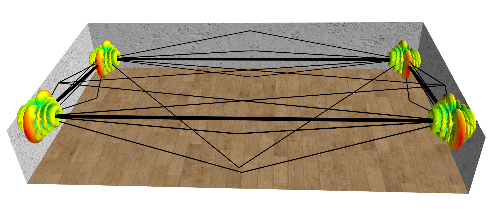

# Q-D visualizer
This repository contains a python application (using Mayavi library) to visualize ns-3 IEEE 802.11ad with Q-D channel simulation results. 

## Features:
1. This application allows to visualizer the beamforming training evolution, and in particular, the SLS TxSS and RxSS phase. Each beamforming training is visualized thanks to the directivity of the antenna pattern resulting of the beamforming training SLS phase.
1. The Multi-Paths components between a pair of transmitter/receiver are displayed.
1. The system level performance (throughput/SNR) can be visualized

The Q-D visualizer comes with three different scenarios corresponding to the one presented in [WNGW19](http://eprints.networks.imdea.org/2006/):
1. L-Shaped Room  
1. Spatial Sharing
1. Dense deployment 

Here is a sample snapshot for our Q-D visualizer:

# Download Information:
Just clone or download the repository.

# Installation
Please refer to *"Install.txt"* document in the *"Source"* folder.

# Usage 
Please refer to *"README.txt"* document in the *"Source"* folder.

# Author Information:
The Q-D visualizer is developed and maintained by [Tanguy Ropitault](https://www.nist.gov/people/tanguy-ropitault).

